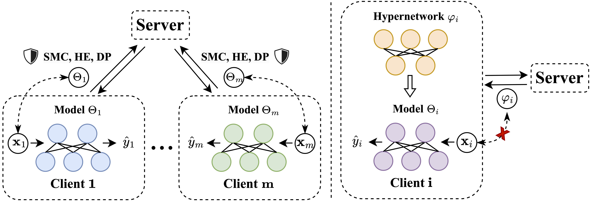
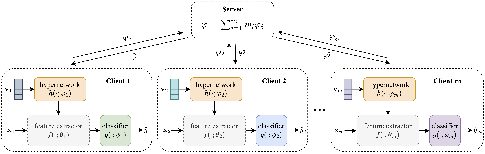

# HyperFL

The implementation of [A New Federated Learning Framework Against Gradient Inversion Attacks](https://arxiv.org/abs/2412.07187) [AAAI 2025]. \
[Pengxin Guo](https://pengxin-guo.github.io)\*, [Shuang Zeng](https://scholar.google.com/citations?user=yTP1oqkAAAAJ&hl=en)\*, Wenhao Chen, Xiaodan Zhang, Weihong Ren, Yuyin Zhou, and [Liangqiong Qu](https://liangqiong.github.io).

 

##### Figure 1. *Left*. Existing methods mainly explore defenses mechanisms on the shared gradients. Such mechanisms, including SMC, HE, and DP, inherently involve substantial privacy-utility trade-offs. *Right*. A novel FL framework that "breaks the direct connection" between the shared parameters and the local private data is proposed to achieve a favorable privacy-utility trade-off.

 

##### Figure 2. The proposed HyperFL framework. HyperFL decouples each client’s network into the former feature extractor $f(; \theta_i)$ and the latter classifier head $g(;{\phi _i})$. An auxiliary hypernetwork $h(;{\varphi _i})$ is introduced to generate local clients’ feature extractor $f(; \theta_i)$  using the client’s private embedding vector $\mathbf{v}_i$, i.e., ${\theta _i} = h({{\bf{v}}_i};{\varphi _i})$. These generated parameters are then used to extract features from the input ${x}_i$, which are subsequently fed into the classifier to obtain the output $\hat{y}_i$, expressed as $\hat{y}_i = g( f({x}_i; \theta_i); \phi_i)$. Throughout the FL training, **only** the hypernetwork  $\varphi_i$ is shared, while all other components are kept private, thus effectively mitigating potential privacy leakage concerns.


## Requirements

Some important required packages are lised below:

- Python 3.10
- Pytorch 2.0.1
- torchvision 0.15.2
- timm 0.9.2


## Usage

### 1. Create a conda environment

```bash
cd ./HyperFL
conda create -n hyperfl python=3.10
conda activate hyperfl
pip install -r requirements.txt
```

### 2. Train and test the model
#### HyperFL
```bash
cd ./cnn
python federated_main.py --gpu 0 --train_rule HyperFL --dataset cifar --local_bs 50 --lr 0.02 --num_users 20 --frac 1.0
```

#### HyperFL-LPM

```bash
cd ./vit
python federated_main.py --gpu 0 --train_rule HyperFL-LPM --dataset cifar
```

```bash
cd ./resnet
python federated_main.py --gpu 0 --train_rule HyperFL-LPM --dataset cifar
```

## Acknowledgement
We would like to thank the authors for releasing the public repository: [FedPAC](https://github.com/JianXu95/FedPAC).